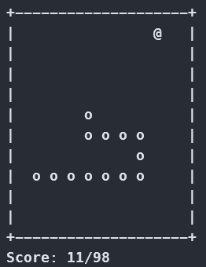

# snake-cpp
Always wanted to implement snake game...

Currently input handling will work only in Windows terminals, because I was too lazy to use `ncurses`.



# Build
```powershell
mkdir build
cd build
cmake ..
cmake --build . --config Debug|Release
```